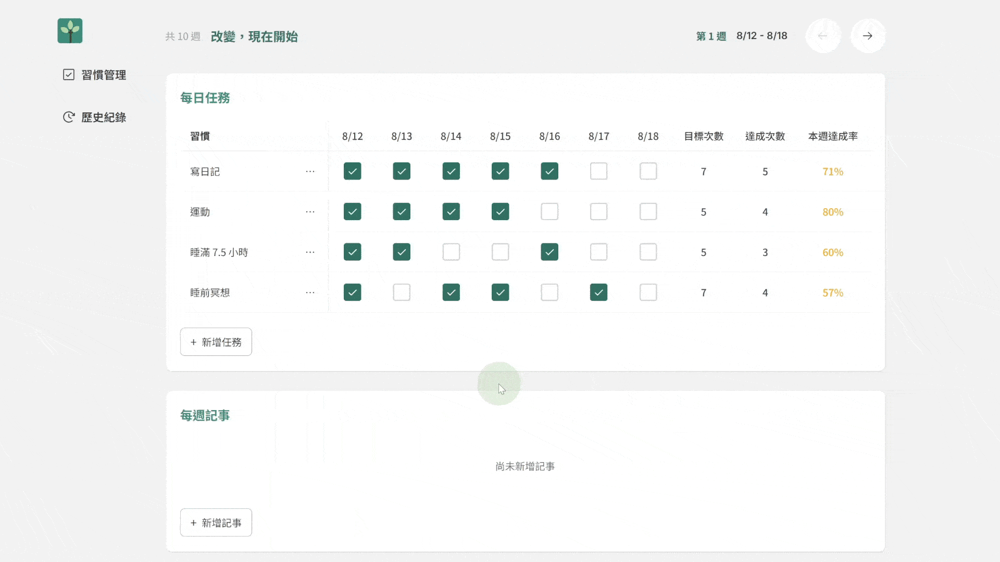

## 📖 專案簡介

Treebit，一個專注於習慣養成的網站，幫助使用者建立每日與每週的目標，發想靈感來自筆記軟體，但進一步簡化流程，讓使用者能更直覺地建立並追蹤習慣。

使用者登入後即可：

- 建立 / 管理習慣
- 追蹤每週進度與打卡紀錄
- 所有資料皆儲存在資料庫中，跨裝置也能保留完整進度

## 🔗 Demo 網站：https://treebit-site.vercel.app/

部署：Vercel（前端+後端）、Railway（MySQL）

```bash
# 測試帳號
帳號：wang@test.com
密碼：123456
```


## ✨ 功能介紹

#### 建立習慣


#### 新增每週任務、記事，及打卡功能



#### 封存任務


## 🛠 技術棧

- **React**：前端 UI 框架，負責元件化開發
- **React Hook Form + Zod**：表單處理與驗證
- **Tailwind CSS + shadcn/ui**：樣式與 UI 元件
- **Node.js / Express**：後端 API 架設
- **JWT + Passport.js**：會員登入與身份驗證，支援第三方登入
- **MySQL**：資料儲存與管理
- **Vercel / Railway**：前後端與資料庫部署

## 🚀 快速開始

1. 取得專案

```bash
git clone https://github.com/eatbear25/Treebit.git
```

2. 前後端各有 .env.example，請複製為 .env 並填入實際值。

3. 安裝與啟動流程

```bash
# 前端
cd frontend
npm install
npm run dev   # http://localhost:3000

# 後端
cd ../backend
npm install
npm run dev   # http://localhost:3001
```

4. 伺服器開啟網址

```
- 前端：http://localhost:3000
- 後端：http://localhost:3001
```

## 資料表設計

| Table              | 說明         |
| ------------------ | ------------ |
| users              | 會員資訊     |
| habits             | 習慣設定     |
| habit_weeks        | 週期資訊     |
| habit_week_tasks   | 每週任務     |
| habit_task_logs    | 任務完成紀錄 |
| habit_weekly_notes | 週記事       |
